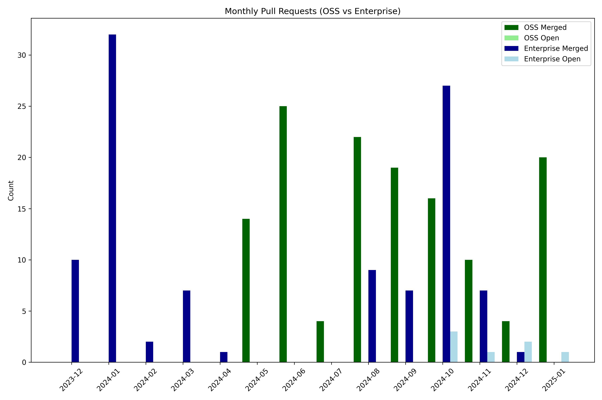

## 2025-01

### Merged Pull Requests

- [#217](https://github.com/daytonaio/docs/pull/217): docs: add wsl2 ssh client troubleshooting setup (merged at: 2025-01-07T07:49:23Z)
- [#216](https://github.com/daytonaio/docs/pull/216): docs: add azure provider service principal note (merged at: 2025-01-07T07:50:47Z)
- [#222](https://github.com/daytonaio/docs/pull/222): docs: sdk (merged at: 2025-01-07T17:03:41Z)
- [#218](https://github.com/daytonaio/docs/pull/218): docs: add samples (merged at: 2025-01-09T08:11:43Z)
- [#215](https://github.com/daytonaio/docs/pull/215): docs: add container registries (merged at: 2025-01-10T09:36:28Z)
- [#232](https://github.com/daytonaio/docs/pull/232): docs: add vscode insiders, vscodium, & windsurf ide (merged at: 2025-01-13T08:29:29Z)
- [#233](https://github.com/daytonaio/docs/pull/233): docs: add sdk section to readme (merged at: 2025-01-13T08:49:25Z)
- [#234](https://github.com/daytonaio/docs/pull/234): docs: add api keys section (merged at: 2025-01-13T16:13:01Z)
- [#214](https://github.com/daytonaio/docs/pull/214): docs: add architecture diagram (merged at: 2025-01-13T16:51:04Z)
- [#205](https://github.com/daytonaio/docs/pull/205): docs: add workspace toolbox (merged at: 2025-01-14T07:44:16Z)
- [#227](https://github.com/daytonaio/docs/pull/227): docs: refactor sdk code snippets & content (merged at: 2025-01-14T07:47:26Z)
- [#203](https://github.com/daytonaio/docs/pull/203): chore(deps): Bump nanoid from 3.3.7 to 3.3.8 (merged at: 2025-01-14T07:51:57Z)

## 2024-12

### Merged Pull Requests

- [#200](https://github.com/daytonaio/docs/pull/200): docs: add gitee provider (merged at: 2024-12-06T14:10:19Z)
- [#209](https://github.com/daytonaio/docs/pull/209): docs: modify installation section side menu (merged at: 2024-12-19T09:42:35Z)
- [#210](https://github.com/daytonaio/docs/pull/210): feat: add search website index (merged at: 2024-12-19T09:42:50Z)
- [#212](https://github.com/daytonaio/docs/pull/212): chore(deps): Bump astro from 4.16.1 to 4.16.18 (merged at: 2024-12-19T16:11:22Z)

### Open Pull Requests

- [#207](https://github.com/daytonaio/docs/pull/207): docs: refactor workspaces, projects, and targets (created at: 2024-12-17T00:25:33Z)

## 2024-11

### Merged Pull Requests

- [#179](https://github.com/daytonaio/docs/pull/179): docs: add gogs git provider (merged at: 2024-11-04T06:28:49Z)
- [#186](https://github.com/daytonaio/docs/pull/186): docs: tabbify installation section (merged at: 2024-11-07T08:05:53Z)
- [#188](https://github.com/daytonaio/docs/pull/188): docs: add gcp and hetzner providers (merged at: 2024-11-12T09:08:31Z)
- [#178](https://github.com/daytonaio/docs/pull/178): feat: add search functionality (merged at: 2024-11-15T07:58:09Z)
- [#193](https://github.com/daytonaio/docs/pull/193): feat: add update llms(.txt) index (standardize LLM-friendly content) (merged at: 2024-11-19T08:16:44Z)
- [#191](https://github.com/daytonaio/docs/pull/191): docs: add docker extension (merged at: 2024-11-19T08:24:58Z)
- [#194](https://github.com/daytonaio/docs/pull/194): chore(deps): Bump cross-spawn from 7.0.3 to 7.0.6 (merged at: 2024-11-19T08:35:05Z)
- [#197](https://github.com/daytonaio/docs/pull/197): docs: hide search without .env set (merged at: 2024-11-20T06:17:12Z)
- [#198](https://github.com/daytonaio/docs/pull/198): feat: search update (index automation & blog) (merged at: 2024-11-25T11:36:01Z)
- [#199](https://github.com/daytonaio/docs/pull/199): feat: add update search to build script (merged at: 2024-11-29T15:41:01Z)

## 2024-10

### Merged Pull Requests

- [#160](https://github.com/daytonaio/docs/pull/160): fix: remove post start commands description (merged at: 2024-10-02T07:58:53Z)
- [#159](https://github.com/daytonaio/docs/pull/159): docs: add workspace multi-projects (merged at: 2024-10-02T09:37:54Z)
- [#162](https://github.com/daytonaio/docs/pull/162): fix: replace --code tip with --no-ide (merged at: 2024-10-09T08:07:11Z)
- [#170](https://github.com/daytonaio/docs/pull/170): docs: add git providers update (merged at: 2024-10-14T07:41:35Z)
- [#166](https://github.com/daytonaio/docs/pull/166): docs: add getting-started quick-start sections (merged at: 2024-10-14T07:49:16Z)
- [#165](https://github.com/daytonaio/docs/pull/165): docs(style): green code/blockquote text value (merged at: 2024-10-14T07:49:36Z)
- [#164](https://github.com/daytonaio/docs/pull/164): docs: fix list formatting (merged at: 2024-10-14T07:49:50Z)
- [#172](https://github.com/daytonaio/docs/pull/172): docs: rename references to tools and resources (merged at: 2024-10-15T06:52:36Z)
- [#176](https://github.com/daytonaio/docs/pull/176): chore(deps): Bump astro from 4.5.16 to 4.16.1 (merged at: 2024-10-15T07:18:49Z)
- [#163](https://github.com/daytonaio/docs/pull/163): docs: builders dev container & modify layout (merged at: 2024-10-15T07:21:29Z)
- [#169](https://github.com/daytonaio/docs/pull/169): docs: update daytona create workspace section (merged at: 2024-10-15T07:23:25Z)
- [#177](https://github.com/daytonaio/docs/pull/177): docs: remove forward --public flag section (merged at: 2024-10-17T06:26:30Z)
- [#180](https://github.com/daytonaio/docs/pull/180): feat: set default target note (merged at: 2024-10-18T14:53:27Z)
- [#182](https://github.com/daytonaio/docs/pull/182): feat: add bash autocompletion instructions (merged at: 2024-10-22T08:47:27Z)
- [#184](https://github.com/daytonaio/docs/pull/184): feat: add troubleshooting section and connectivity entry (merged at: 2024-10-25T12:37:31Z)
- [#181](https://github.com/daytonaio/docs/pull/181): docs: add offerings availability label (merged at: 2024-10-28T08:46:43Z)

## 2024-09

### Merged Pull Requests

- [#128](https://github.com/daytonaio/docs/pull/128): docs: consistent style indentation formatting (merged at: 2024-09-03T07:49:30Z)
- [#141](https://github.com/daytonaio/docs/pull/141): docs: add docker local & remote server requirements (merged at: 2024-09-06T11:12:37Z)
- [#142](https://github.com/daytonaio/docs/pull/142): docs: add workspace samples entry (merged at: 2024-09-06T11:13:41Z)
- [#146](https://github.com/daytonaio/docs/pull/146): docs: add wsl ssh client setup instructions note (merged at: 2024-09-06T11:16:46Z)
- [#140](https://github.com/daytonaio/docs/pull/140): docs: fix broken links & hyperlinks (merged at: 2024-09-09T07:11:58Z)
- [#137](https://github.com/daytonaio/docs/pull/137): chore(deps): Bump pagefind from 1.0.4 to 1.1.1 (merged at: 2024-09-11T07:51:35Z)
- [#149](https://github.com/daytonaio/docs/pull/149): chore(deps): Bump express from 4.19.2 to 4.20.0 (merged at: 2024-09-11T07:53:21Z)
- [#136](https://github.com/daytonaio/docs/pull/136): chore(deps): Bump @pagefind/default-ui from 1.0.4 to 1.1.1 (merged at: 2024-09-11T07:54:24Z)
- [#145](https://github.com/daytonaio/docs/pull/145): docs: add supported git providers note to prebuilds (merged at: 2024-09-11T14:54:35Z)
- [#144](https://github.com/daytonaio/docs/pull/144): docs(style): add prebuilds icon (merged at: 2024-09-11T14:55:20Z)
- [#147](https://github.com/daytonaio/docs/pull/147): docs: update readme (merged at: 2024-09-12T07:39:29Z)
- [#151](https://github.com/daytonaio/docs/pull/151): chore(deps): Bump dset from 3.1.3 to 3.1.4 (merged at: 2024-09-12T08:50:02Z)
- [#152](https://github.com/daytonaio/docs/pull/152): fix: light theme flickering (merged at: 2024-09-16T08:01:37Z)
- [#154](https://github.com/daytonaio/docs/pull/154): fix error docker target config link (merged at: 2024-09-16T08:02:16Z)
- [#155](https://github.com/daytonaio/docs/pull/155): chore(deps): Bump vite from 5.2.11 to 5.2.14 (merged at: 2024-09-18T10:40:24Z)
- [#150](https://github.com/daytonaio/docs/pull/150): docs: add jetbrains fleet & jupyter ide (merged at: 2024-09-20T13:09:46Z)
- [#143](https://github.com/daytonaio/docs/pull/143): docs: add cursor ide (merged at: 2024-09-20T15:48:26Z)
- [#156](https://github.com/daytonaio/docs/pull/156): fix: remove hardcoded directory in devcontainer.json file (merged at: 2024-09-23T08:36:45Z)
- [#157](https://github.com/daytonaio/docs/pull/157): chore(deps): Bump rollup from 4.17.2 to 4.22.4 (merged at: 2024-09-24T15:28:12Z)

## 2024-08

### Merged Pull Requests

- [#96](https://github.com/daytonaio/docs/pull/96): docs: workspaces section textual and visual improvements (merged at: 2024-08-06T07:19:01Z)
- [#104](https://github.com/daytonaio/docs/pull/104): docs: telemetry section textual and visual improvements (merged at: 2024-08-07T07:15:45Z)
- [#100](https://github.com/daytonaio/docs/pull/100): style: remove text code block copy icon (merged at: 2024-08-07T07:25:47Z)
- [#103](https://github.com/daytonaio/docs/pull/103): docs: modify support anchor tag hyperlink (merged at: 2024-08-08T07:39:59Z)
- [#102](https://github.com/daytonaio/docs/pull/102): docs: providers section textual and visual improvements (merged at: 2024-08-08T07:43:03Z)
- [#94](https://github.com/daytonaio/docs/pull/94): fix: Some links are broken at daytona.io documentation page (merged at: 2024-08-09T12:52:08Z)
- [#107](https://github.com/daytonaio/docs/pull/107): docs: footer version reference package.json (merged at: 2024-08-12T07:22:29Z)
- [#101](https://github.com/daytonaio/docs/pull/101): docs: git providers section textual and visual improvements (merged at: 2024-08-12T09:44:09Z)
- [#106](https://github.com/daytonaio/docs/pull/106): docs: add purge manual instructions (merged at: 2024-08-12T11:28:21Z)
- [#113](https://github.com/daytonaio/docs/pull/113): docs: remove prerequisites and procedures notes (merged at: 2024-08-13T09:25:59Z)
- [#105](https://github.com/daytonaio/docs/pull/105): docs: server section textual and visual improvements (merged at: 2024-08-14T08:32:58Z)
- [#111](https://github.com/daytonaio/docs/pull/111): docs: add individual ide process (merged at: 2024-08-14T08:37:16Z)
- [#115](https://github.com/daytonaio/docs/pull/115): docs: add project configurations (merged at: 2024-08-20T07:17:39Z)
- [#119](https://github.com/daytonaio/docs/pull/119): docs: fix incorrect redirect (merged at: 2024-08-21T06:25:42Z)
- [#116](https://github.com/daytonaio/docs/pull/116): docs: getting started onboarding section (merged at: 2024-08-21T10:54:56Z)
- [#114](https://github.com/daytonaio/docs/pull/114): chore: update slack link to daytona redirect (merged at: 2024-08-21T10:55:14Z)
- [#117](https://github.com/daytonaio/docs/pull/117): chore: update devcontainer to run as daytona user (merged at: 2024-08-21T12:21:25Z)
- [#121](https://github.com/daytonaio/docs/pull/121): Fix: Uninstall Command in Daytona Documentation (merged at: 2024-08-23T13:44:02Z)
- [#120](https://github.com/daytonaio/docs/pull/120): docs: update index with new sections (merged at: 2024-08-27T15:17:54Z)
- [#124](https://github.com/daytonaio/docs/pull/124): docs: add new providers (merged at: 2024-08-30T15:54:50Z)
- [#125](https://github.com/daytonaio/docs/pull/125): docs: add prebuilds (merged at: 2024-08-30T16:08:07Z)
- [#126](https://github.com/daytonaio/docs/pull/126): docs: fix cli reference hyperlink (merged at: 2024-08-30T16:11:22Z)

## 2024-07

### Merged Pull Requests

- [#80](https://github.com/daytonaio/docs/pull/80): 47 implement tabbed interface from figma design (merged at: 2024-07-25T12:02:53Z)
- [#89](https://github.com/daytonaio/docs/pull/89): docs: update server docs link (merged at: 2024-07-25T12:03:17Z)
- [#93](https://github.com/daytonaio/docs/pull/93): feat: add telemetry page (merged at: 2024-07-26T09:22:46Z)
- [#97](https://github.com/daytonaio/docs/pull/97): fix: minor text whitespace formatting (merged at: 2024-07-31T07:48:10Z)

## 2024-06

### Merged Pull Requests

- [#38](https://github.com/daytonaio/docs/pull/38): docs: add new Server icon (merged at: 2024-06-04T09:45:14Z)
- [#51](https://github.com/daytonaio/docs/pull/51): Fix company name in footer (merged at: 2024-06-04T13:21:40Z)
- [#48](https://github.com/daytonaio/docs/pull/48): Use new Aside component in the Installation guide (merged at: 2024-06-04T13:30:22Z)
- [#50](https://github.com/daytonaio/docs/pull/50): Strip patch from Version component (merged at: 2024-06-04T13:34:28Z)
- [#44](https://github.com/daytonaio/docs/pull/44): Fix colours on light mode (merged at: 2024-06-06T09:35:23Z)
- [#56](https://github.com/daytonaio/docs/pull/56): docs: add new Builders reference (merged at: 2024-06-06T13:21:33Z)
- [#58](https://github.com/daytonaio/docs/pull/58): Add --host to Astro server commands in package.json scripts (merged at: 2024-06-07T12:09:36Z)
- [#57](https://github.com/daytonaio/docs/pull/57): Fix broken changelog link in the Footer (merged at: 2024-06-07T12:09:47Z)
- [#40](https://github.com/daytonaio/docs/pull/40): Automate CLI reference generation (merged at: 2024-06-07T21:12:27Z)
- [#63](https://github.com/daytonaio/docs/pull/63): Move individual Builders to h2 level (merged at: 2024-06-11T16:08:48Z)
- [#67](https://github.com/daytonaio/docs/pull/67): fix: markdown content spacing (merged at: 2024-06-17T13:50:30Z)
- [#70](https://github.com/daytonaio/docs/pull/70): Change numbers >10 to words across the docs (merged at: 2024-06-19T07:38:02Z)
- [#62](https://github.com/daytonaio/docs/pull/62): Add instructions to set custom build registry (merged at: 2024-06-19T07:39:10Z)
- [#72](https://github.com/daytonaio/docs/pull/72): add table wrappers to table inside markdown content (merged at: 2024-06-19T07:44:21Z)
- [#59](https://github.com/daytonaio/docs/pull/59): Restructure installation, add new procedures and update references (merged at: 2024-06-19T08:15:50Z)
- [#60](https://github.com/daytonaio/docs/pull/60): Add more context to introduction of CLI reference (merged at: 2024-06-19T08:19:56Z)
- [#78](https://github.com/daytonaio/docs/pull/78): Add Gitness information to Git Providers docs (merged at: 2024-06-21T12:11:06Z)
- [#61](https://github.com/daytonaio/docs/pull/61): Add instructions to delete multiple Workspaces (merged at: 2024-06-21T12:11:47Z)
- [#74](https://github.com/daytonaio/docs/pull/74): Move Server page to Usage section (merged at: 2024-06-21T12:12:04Z)
- [#69](https://github.com/daytonaio/docs/pull/69): Add API reference for the server (merged at: 2024-06-26T12:12:21Z)
- [#75](https://github.com/daytonaio/docs/pull/75): change expressive code light theme (merged at: 2024-06-26T13:22:51Z)
- [#82](https://github.com/daytonaio/docs/pull/82): chore: and linting and formatting (merged at: 2024-06-28T07:56:54Z)
- [#79](https://github.com/daytonaio/docs/pull/79): add workspace create flags usage tip (merged at: 2024-06-28T10:13:43Z)
- [#83](https://github.com/daytonaio/docs/pull/83): chore(deps): Bump braces from 3.0.2 to 3.0.3 (merged at: 2024-06-28T10:18:12Z)
- [#84](https://github.com/daytonaio/docs/pull/84): feat: add non-root remote user caution (merged at: 2024-06-28T10:21:53Z)

## 2024-05

### Merged Pull Requests

- [#1](https://github.com/daytonaio/docs/pull/1): Initial docset (merged at: 2024-05-22T14:08:50Z)
- [#6](https://github.com/daytonaio/docs/pull/6): Remove dead link to Targets documentation on homepage (merged at: 2024-05-23T12:35:03Z)
- [#15](https://github.com/daytonaio/docs/pull/15): Update Dev Container to node@22 (merged at: 2024-05-23T16:35:10Z)
- [#9](https://github.com/daytonaio/docs/pull/9): Change `npm` refs to `yarn` in README (merged at: 2024-05-23T16:45:54Z)
- [#17](https://github.com/daytonaio/docs/pull/17): Add installation instructions for Homebrew (merged at: 2024-05-24T11:09:05Z)
- [#21](https://github.com/daytonaio/docs/pull/21): Rename Dev Environments to Workspaces (merged at: 2024-05-24T13:03:00Z)
- [#23](https://github.com/daytonaio/docs/pull/23): Add README and common Daytona docs (merged at: 2024-05-27T16:06:07Z)
- [#26](https://github.com/daytonaio/docs/pull/26): Add note about VS Code - Browser to Workspaces page (merged at: 2024-05-29T12:03:37Z)
- [#28](https://github.com/daytonaio/docs/pull/28): Added edit page button on end of article (merged at: 2024-05-29T12:04:48Z)
- [#24](https://github.com/daytonaio/docs/pull/24): configuration/providers: new documentation (merged at: 2024-05-29T13:48:52Z)
- [#18](https://github.com/daytonaio/docs/pull/18): Add port forwarding procedures to Dev Environments page (merged at: 2024-05-29T14:03:07Z)
- [#30](https://github.com/daytonaio/docs/pull/30): Fix broken links on home page (merged at: 2024-05-29T14:41:16Z)
- [#25](https://github.com/daytonaio/docs/pull/25): Update sidebar icons (merged at: 2024-05-30T11:35:14Z)
- [#36](https://github.com/daytonaio/docs/pull/36): Asides (Admonitions) restyle (merged at: 2024-05-31T14:02:25Z)